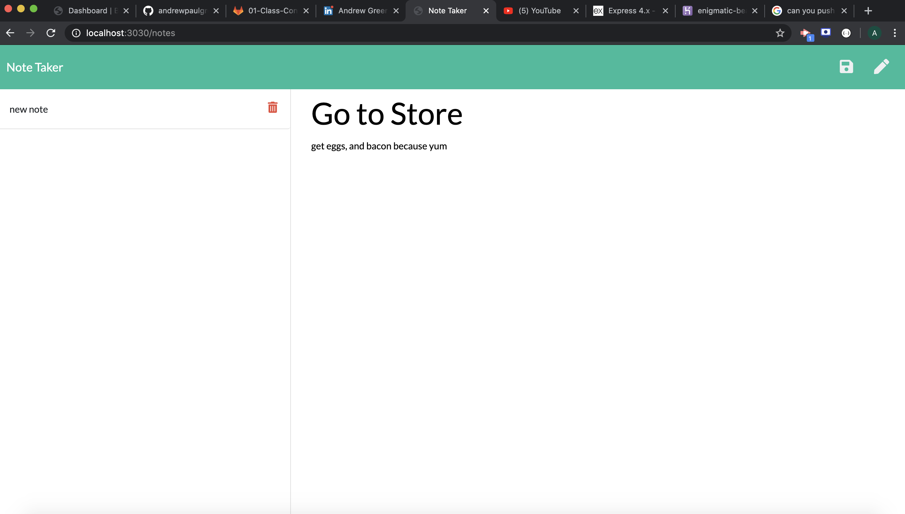
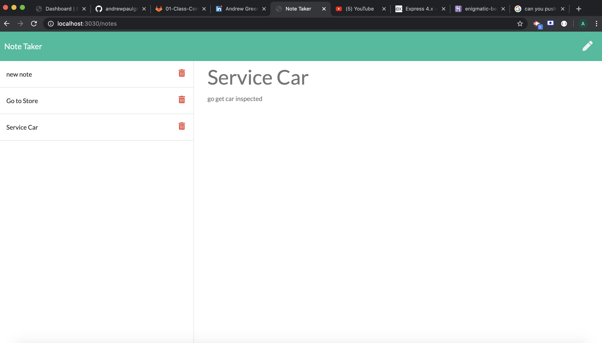

# Note-Taker
Note taker application using express. We were challeneged with creating the server for this applicaiton. Getting the moving pieces of this application were certainly challenging for this app. I did try t ostart this assignment prior to learning in class concepts and wound up completely re factoring my code in this assignment to be more dry.

## Table of Contents

- [Installation](#installation)
- [License](#license)
- [Usage](#usage)
- [Contributing](#contributing)
- [Tests](#tests)
- [Questions](#questions)

## Installation

npm i

## License

## Usage

YouTube Demonstration Link: https://youtu.be/OqgpEm7H0io

Server Code

Creating a note

Here is an example of adding a new note

## Contributing

Andrew Greer

## Tests

run NPM i, and ask questions for this applicaiotn

## Questions

Email: andrewgreer2015@gmail.com

Github: andrewpaulgreer

